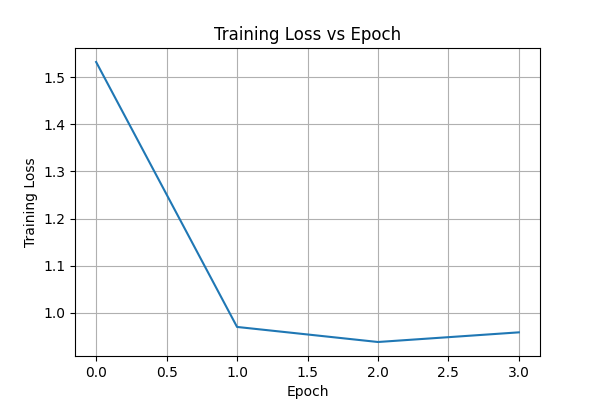
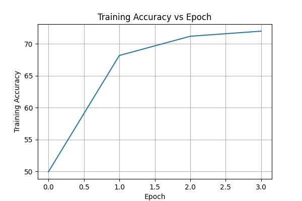
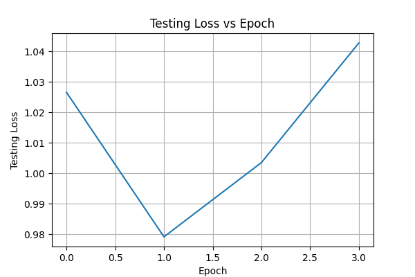
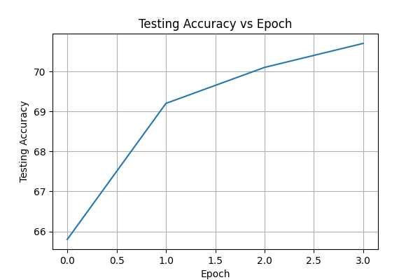
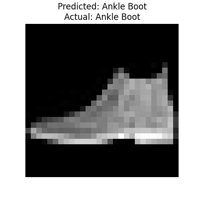

# Fashion MNIST CNN from Scratch

## Project Title
Fashion MNIST Image Classification using Convolutional Neural Network (CNN) from Scratch using NumPy

---

## Github Repository Name

xxxxx_<USN>_Fashion_MNIST_CNN

Example:

UE24CS645BC2_PES1PG25CS090_Fashion_MNIST_CNN

---

# Project Description

This project implements a Convolutional Neural Network (CNN) completely from scratch using Python and NumPy for Fashion MNIST image classification.

The project includes:

- Convolution Layer
- Max Pooling Layer
- Fully Connected Layer
- Forward Propagation
- Backward Propagation
- Training and Testing Pipeline
- Accuracy and Loss Visualization
- Fashion MNIST Classification

The CNN model is trained on Fashion MNIST dataset and evaluated using training and testing accuracy/loss metrics.

---

# Dataset Used

Fashion MNIST Dataset

Dataset contains:
- 60,000 training images
- 10,000 testing images
- 10 classes

Image Size:
28 × 28 grayscale images

Classes:
1. T-shirt/top
2. Trouser
3. Pullover
4. Dress
5. Coat
6. Sandal
7. Shirt
8. Sneaker
9. Bag
10. Ankle Boot

---

# Tasks Implemented

## 1. Define Convolution Operation and Build Convolution Layer

Implemented convolution operation manually using NumPy.

Functions:
- forward()
- backward()

Purpose:
Extract spatial features from images using learnable filters.

---

## 2. Define the Forward Pass Function

Forward pass performs:
- Convolution
- Max Pooling
- Fully Connected Layer
- Softmax Activation

Purpose:
Generate prediction probabilities.

---

## 3. Define the Backward Pass Function

Backward propagation updates:
- Convolution filters
- Fully connected weights

Gradient descent is used for optimization.

Purpose:
Reduce prediction error during training.

---

## 4. Define MaxPool Function

Implemented Max Pooling manually.

Purpose:
- Reduce feature map dimensions
- Reduce computation
- Preserve important features

---

## 5. Build Fully Connected Layer

Fully connected layer implemented using:
- Softmax activation function

Purpose:
Convert extracted CNN features into class probabilities.

---

## 6. Define Training Function

Training pipeline performs:
1. Forward pass
2. Loss calculation
3. Backward propagation
4. Weight updates

Repeated for multiple epochs.

---

## 7. Evaluate the CNN Model

Model evaluation includes:
- Training Accuracy
- Training Loss
- Testing Accuracy
- Testing Loss

Graphs are generated for all metrics.

---

# Technologies Used

- Python
- NumPy
- Matplotlib

---

# Project Structure

```bash
Fashion_MNIST_CNN/
│
├── cnn.py
├── layers.py
├── utils.py
├── main.py
├── requirements.txt
├── README.md
│
├── training_loss_graph.png
├── training_accuracy_graph.png
├── testing_loss_graph.png
├── testing_accuracy_graph.png
└── sample_prediction.png

# How to Run the Project

## Step 1: Clone Repository

```bash
git clone <repository_link>
```

---

## Step 2: Install Dependencies

```bash
pip install -r requirements.txt
```

---

## Step 3: Run the Project

```bash
python main.py
```

---

# Output

The project generates:

- Epoch-wise training/testing results
- Accuracy and loss graphs
- Sample image prediction

---

# Accuracy and Loss Comparison Table

| Epoch | Training Accuracy | Training Loss | Testing Accuracy | Testing Loss |
|------|-------------------|---------------|------------------|---------------|
| 1 | 49.9% | 1.53 | 65.8% | 1.02 |
| 2 | 68.2% | 0.97 | 69.2% | 0.98 |
| 3 | 71.2% | 0.94 | 70.1% | 1.00 |
| 4 | 71.9% | 0.96 | 70.7% | 1.04 |

---

# Training Loss vs Epoch



---

# Training Accuracy vs Epoch



---

# Testing Loss vs Epoch



---

# Testing Accuracy vs Epoch



---

# Sample Prediction



---

# Learning Outcomes

Through this project, the following concepts were understood:

- CNN Architecture
- Convolution Operation
- Feature Extraction
- Max Pooling
- Forward Propagation
- Backward Propagation
- Gradient Descent
- Softmax Activation
- Image Classification

---

# Conclusion

The CNN model successfully classifies Fashion MNIST images with good accuracy using a CNN built completely from scratch without deep learning frameworks such as TensorFlow or PyTorch.

The project demonstrates understanding of CNN internal working and deep learning fundamentals.